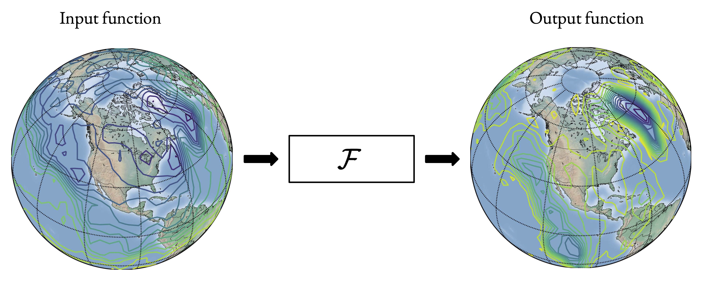

# TRIPODS Winter School & Workshop on Interplay between Artificial Intelligence (AI) and Dynamical Systems

## Practicum on Supervised Learning in Function Spaces, January 18th-21st, 2022

### Instructors: 
- [Paris Peridkaris](https://directory.seas.upenn.edu/paris-perdikaris/) (University of Pennsylvania, <pgp@seas.upenn.edu>)
- [Jacob Seidman](https://sites.google.com/site/victormpreciado/publications/group) (University of Pennsylvania, <seidj@seas.upenn.edu>)
- [Georgios Kissas](https://scholar.google.com/citations?user=PEwbH74AAAAJ&hl=en) (University of Pennsylvania, <gkissas@seas.upenn.edu>)

### Schedule

#### Part 1 (11:00am-12:15pm EST)

#### Part 2 (12:30pm-1:30pm EST)

#### Part 3 (2:30pm-3:30pm EST)

#### Part 4 (3:45pm-5:00pm EST)

